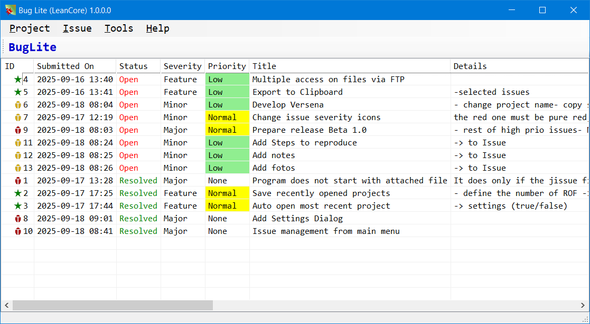

# BugLite – Minimal Local Bug Tracker

## Overview

**BugLite** is a lightweight, portable bug tracker designed for small projects and personal use.
It focuses on simplicity: record issues, track their status, severity and priority, and organize them by project — no database server required.

* **Platform:** Windows (WinForms)
* **Storage:** JSON file (`myproject.jissue`): `.jissue` being the default extension for the issue files
* **Assigned default file type** The default extension, if declared in registry, will be automatically opened by BugLite.exe
* **UI:** Clean list-based interface with datetime, status, severity and priority filters
* **Goal:** Minimal setup, fast and portable, easy to extend

---

## Features

* Track issues with:

  * ID (auto-increment)
  * Project-based (a `.jissue` per project): you can store them in your project folder so that it can be handled together with other project files)
  * Title / short description
  * Status: Open / In Progress / Resolved / Closed
  * Severity: Feature / Minor / Normal / Major
  * Priority: None / Low / Normal / High
  * Detailed description
  * Creation and modification dates
* Filter and sort by DateTime, Status, Severity, Priority
* Create, edit, close projects via dialogs
* Add, edit, delete issues via dialogs
* All data stored in a single JSON file — portable and human-readable
* Optional future enhancements: export to CSV, search box, tags/labels, external storage

---

## Screenshots / UI Mockups (Ideas)

<!---->

* Main window with **ListView showing all issues**
* “New Bug” dialog with input fields for Project, Title, Status, Description
* Optional filter panel: Project dropdown + Status dropdown

---

## Installation

1. Download the executable (`BugLite_xxx.exe`) and place it in any folder.
2. Run `BugLite_xxx.exe` → extracts all necessary .exe and .dll files into that folder.
3. Start adding issues right away — no setup required.

---

## Usage
* **New Project** → Opens a project dialog to enter the new project's name and description. The new project will the be stored into a file defined by the user.
* **Edit Project** → Opens a project dialog to modify the properties of the active project.
* **Close Project** → Closes the active project.
* **Recent Projects** → Opens the list of recently used projects. By clicking on a project file name the project will be opened, if it exists; otherwise the entry will be removed from the list.
* **Save As** → Saves the project under a different file name.
* **Add Issue:** Opens an Issue dialog to enter a new issue.
* **Edit Issue:** Opens an Issue dialog with the properties of the selected issue. OK → modified properties will be stored.
* **Delete Issue:** Asks the user if they will to delete the issue selected. OK → issue will be deleted.
* **Tools/Settings:** Opens the settings dialog.

---

## Roadmap / Future Enhancements

* Filter by text, date, or priority
* Export to CSV for reporting
* Optional “user roles” for team collaboration
* Optional attachments per issue
* Optional "Steps to reproduce"
* Optional "Notes"
* Optional dark/light theme

